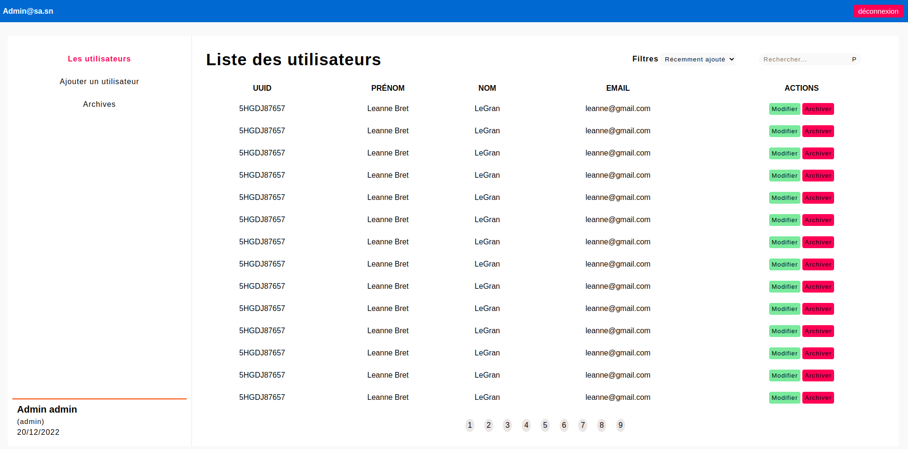
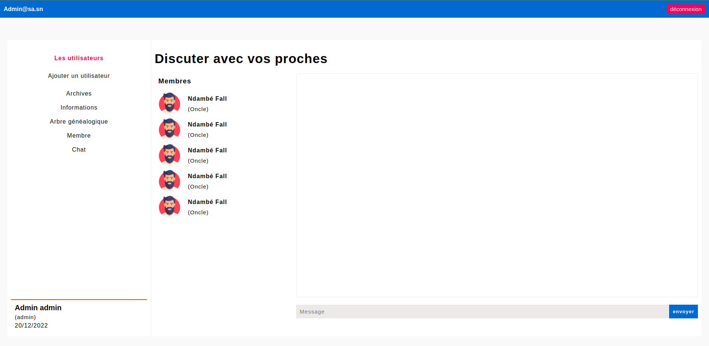
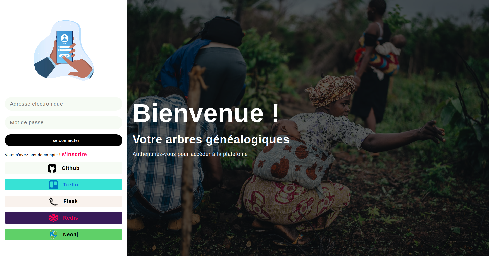

# FAMILY TREES PROJECT (encours)

## __**Objectif :**__ Le but du projet est de mettre en place une application permettant de gérer des arbres généalogiques

#### *Outils utilisés :* **FLASK** - **Neo4j** - **Trello**

#### *Langage de programmation :* Python |  Javascript  |  Cypher

#### *Pages :* Page de connexion |  Page Administrateur  |  Page utilisateur

##### **Chat :** L'utilisateur peux envoyer, répondre et lire des messages (via le chat) à un ou plusieurs membres de sa famille.

#### *Dépendances du projet :* Toutes les dépendances seront mis dans le fichier requirements.txt

## **Page Admin**

## **Page Chat**

## **Page de Connexion**

**Remarque :** J'ai développé un mini framework css (voir dans static/css)

# Version 2 du projet
Je mettrai en place le chat